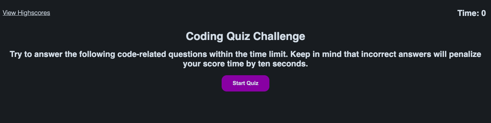

# code-quiz
A coding boot camp student wants to take a timed quiz on JavaScript fundamentals that stores high scores so that they can gauge their progress compared to their peers.

# Description of Work
1. When the student clicks the start button a timer starts from 180 seconds. 
2. The student is also presented with a question.
3. When the student answers the question, they are informed whether it is correct or incorrect and presented with another question.
4. If the student answers a question incorrectly, 10 seconds is subtracted from the timer.
5. When all questions are answered or the timer reaches 0, then the game is over and they can save their initials and their score.

# Screenshot of Browser

# Link to Deployed Page
https://jooreea.github.io/code-quiz/